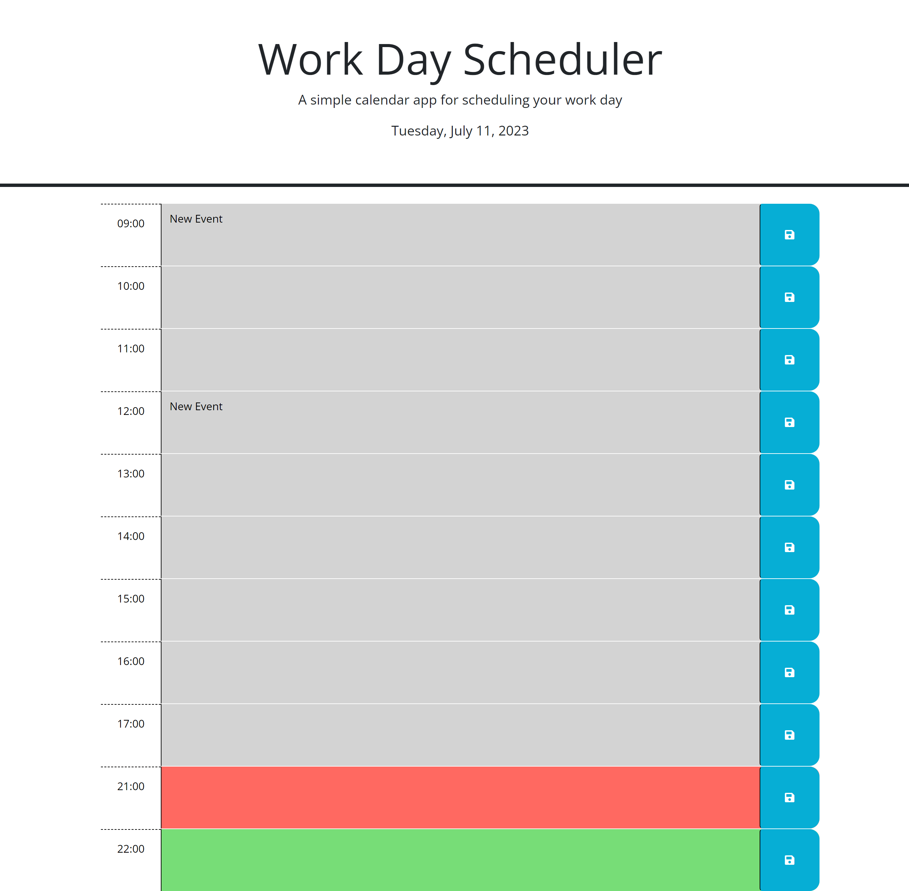

# Work day schedule Homework 5
## acceptance criteria 
    GIVEN I am using a daily planner to create a schedule
    WHEN I open the planner
    THEN the current day is displayed at the top of the calendar
    WHEN I scroll down
    THEN I am presented with timeblocks for standard business hours of 9am&ndash;5pm
    WHEN I view the timeblocks for that day
    THEN each timeblock is color coded to indicate whether it is in the past, present, or future
    WHEN I click into a timeblock
    THEN I can enter an event
    WHEN I click the save button for that timeblock
    THEN the text for that event is saved in local storage
    WHEN I refresh the page
    THEN the saved events persist
## My contributions
    For this assignment I was provided the Html and the CSS by the UCF bootcamp. I made each time block for a full work day in the html 
    so a full work day would be visible. This action was a simple copy past from the provided examples. I then edited each time block to 
    reflect the progression of the hours from 0900 hours to 1700 hours. Once the time blocks had the correct time, I removed the classes 
    for the past, current, and future as to not interfere with the time progression implemented later on. nothing was changed in the CSS 
    as it was unneccesary. 

    Within the Javascript, I placed the current date in the header using day.js. The next step was to create a function that kept track 
    of the current time and applied the proper CSS to reflect it. I began by making the variable for the time blocks and a variable to 
    hold the current hour. A loop was then created with the .each method in jquery. An if statement is established to check the current 
    time to know which time block is the most current one. lastly, if statements are then created to apply the proper CSS depending on
    which time block is currently active. 

    The last issue that was addressed was saving the text within the time blocks. This was done by specifying the save button and its 
    functionality. the functionality is established by gathering the time and the text values. once those are gathered they will be saved 
    onto the local storage. Once on the local storage, if the page is refreshed the time blocks and their text values need to be recalled 
    and displayed upon that refresh. this was done by gathering the values for each hour by id and their value in the local storage. 
    Jquery was heavily used in this assignment which allowed for great practice at traversing the website and understanding where to find
    certain subjects.
## screenshot 
    
## link

